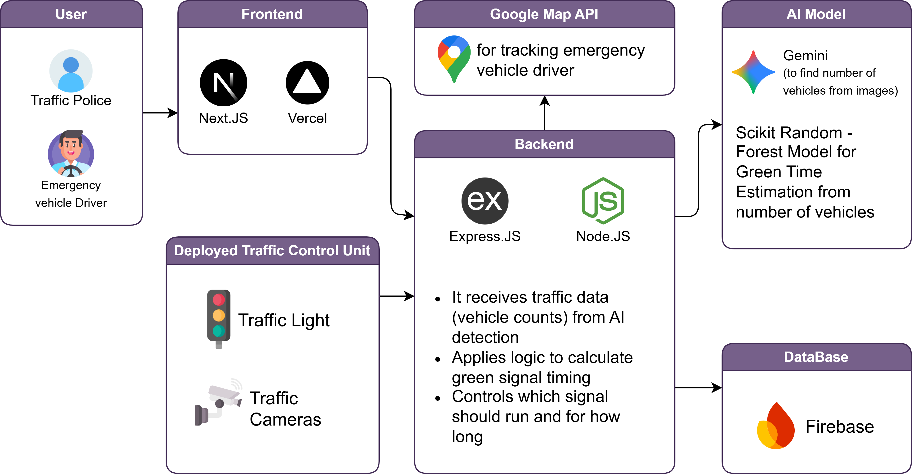

<p align="center">
  
</p>

<h1 align="center">⚡ SmartFlow — AI-Powered Traffic Signal Optimization</h1>

<p align="center">
  <strong>An intelligent, real-time traffic management system that leverages AI vision, machine learning, and dynamic signal optimization to reduce congestion and enable emergency vehicle preemption.</strong>
</p>

<p align="center">
  <a href="https://smartflow-inky.vercel.app/">🌐 Live Frontend</a> &nbsp;•&nbsp;
  <a href="https://smartflow-backend.up.railway.app">⚙️ Live Backend</a> &nbsp;•&nbsp;
  <a href="https://smartflow-traffic-simulation.vercel.app/">🚦 Live Simulation</a> &nbsp;•&nbsp;
  <a href="https://smartflow-greenlight-model.up.railway.app">🤖 Green Light Model</a>
</p>

---

## 📖 Table of Contents

- [Overview](#-overview)
- [Key Features](#-key-features)
- [System Architecture](#-system-architecture)
- [Tech Stack](#-tech-stack)
- [Repository Structure](#-repository-structure)
- [Getting Started](#-getting-started)
  - [Prerequisites](#prerequisites)
  - [Frontend Setup](#1-frontend-dashboard)
  - [Backend Setup](#2-backend-api)
  - [Traffic Simulation Setup](#3-traffic-simulation-engine)
  - [Green Time ML Model Setup](#4-green-time-ml-model)
- [API Reference](#-api-reference)
- [AI & ML Pipeline](#-ai--ml-pipeline)
- [Frontend Pages & Features](#-frontend-pages--features)
- [Traffic Simulation Engine](#-traffic-simulation-engine)
- [Environment Variables](#-environment-variables)
- [Deployment](#-deployment)
- [Design System](#-design-system)
- [Contributing](#-contributing)
- [License](#-license)
- [Author](#-author)

---

## 🧠 Overview

**SmartFlow** is a comprehensive AI-driven traffic signal control system designed for smart city infrastructure. It combines **computer vision** (Gemini AI), a **Random Forest ML model**, and **real-time dashboard analytics** to dynamically optimize traffic signal timing at intersections.

The system processes live camera feeds from traffic intersections, counts vehicles using Google's Gemini 2.5 Flash model, calculates optimal green light durations proportionally, and provides traffic administrators with a full-featured dashboard for monitoring, manual overrides, and emergency vehicle prioritization.

### 🎯 Problem Statement

Traditional traffic lights use fixed timing cycles regardless of actual traffic conditions, leading to:
- Unnecessary waiting at empty intersections
- Cascading congestion during peak hours
- Delayed emergency vehicle response times

### 💡 Solution

SmartFlow replaces fixed-cycle signals with an adaptive AI system that:
1. **Detects** vehicle counts from camera images via Gemini AI Vision
2. **Predicts** optimal green light duration using a trained ML model
3. **Allocates** signal time proportionally across intersection roads
4. **Preempts** signals for emergency vehicles with green corridors
5. **Empowers** admins with real-time dashboards and manual override controls

---

## 🌟 Key Features

| Feature | Description |
|---|---|
| **🤖 AI Vehicle Detection** | Gemini 2.5 Flash processes traffic camera images to count vehicles per lane |
| **🌲 ML Green Time Prediction** | Random Forest Regressor predicts optimal green signal duration based on vehicle count |
| **📊 Real-Time Dashboard** | Live traffic load visualization, system health monitoring, and AI mode indicators |
| **⚙️ Manual Override Control** | Admin panel to override AI decisions and force-green specific roads |
| **🚨 Emergency Vehicle Preemption** | Live route tracking, green corridor activation, and incident management |
| **🔔 Smart Alert System** | AI-generated alerts for congestion, emergencies, and system events with auto-resolution |
| **📈 Advanced Analytics** | Traffic trend charts, road-wise load analysis, before/after AI comparisons |
| **🚦 Traffic Simulation Engine** | Interactive intersection visualization with density sliders and signal animations |
| **🔐 Admin Authentication** | JWT-based secure login with bcrypt password hashing |
| **⚡ Dynamic Cycle Algorithm** | Adaptive cycle times (60s/90s/120s) based on total traffic volume |

---

## 🏗 System Architecture

```
┌──────────┐     ┌─────────────────┐     ┌──────────────────┐     ┌─────────────────┐
│   User   │────▶│    Frontend     │────▶│     Backend      │────▶│    AI Models     │
│(Admin /  │     │  (Next.js 16)   │     │ (Express + Node) │     │                 │
│Emergency)│     │  Vercel Deploy  │     │ Railway Deploy   │     │ • Gemini 2.5    │
└──────────┘     └─────────────────┘     │                  │     │   (Vision AI)   │
                                         │ • MongoDB        │     │ • RandomForest  │
┌──────────────┐                         │ • Redis Cache    │     │   (Green Time)  │
│Traffic Camera│────────────────────────▶│ • JWT Auth       │     │ Railway Deploy  │
│   Feeds      │                         │ • Multer Upload  │     └─────────────────┘
└──────────────┘                         └──────────────────┘
```

### Data Flow

1. **Traffic cameras** capture images from 4 intersection roads (A, B, C, D)
2. Images are uploaded via the **backend API** as multipart form data
3. The backend sends base64-encoded images to **Gemini 2.5 Flash** for vehicle counting
4. Vehicle counts are fed to the **green time algorithm** which calculates proportional signal durations
5. Optionally, counts are sent to the **Random Forest ML model** for green time prediction
6. Results are displayed on the **real-time frontend dashboard**
7. Admins can **manually override** signals or activate **emergency preemption**

---

## 🛠 Tech Stack

### Frontend Dashboard (`smartflow-frontend`)
| Technology | Version | Purpose |
|---|---|---|
| Next.js | 16.2.2 | React framework with App Router |
| React | 19.2.4 | UI component library |
| TypeScript | ^5 | Type safety |
| Tailwind CSS | v4 | Utility-first styling |
| Zustand | ^5.0.12 | Global state management |
| Recharts | ^3.8.1 | Data visualization / charts |
| React Icons | ^5.6.0 | Icon library |

### Backend API (`smartflow-backend`)
| Technology | Version | Purpose |
|---|---|---|
| Express | ^5.2.1 | HTTP server framework |
| TypeScript | ^6.0.2 | Type safety |
| MongoDB / Mongoose | ^9.3.3 | Database for admin & session data |
| Redis | ^5.11.0 | Caching layer |
| Google GenAI SDK | ^1.47.0 | Gemini AI integration |
| JWT (jsonwebtoken) | ^9.0.3 | Authentication tokens |
| bcrypt | ^6.0.0 | Password hashing |
| Multer | ^2.1.1 | File upload handling |

### Traffic Simulation (`smartflow-traffic-simulation`)
| Technology | Version | Purpose |
|---|---|---|
| Next.js | 16.2.2 | React framework with App Router |
| React | 19.2.4 | UI component library |
| TypeScript | ^5 | Type safety |
| Tailwind CSS | v4 | Utility-first styling |
| Lucide React | ^1.7.0 | Icon set |

### Green Time ML Model (`green_time_model`)
| Technology | Purpose |
|---|---|
| Python | Runtime |
| scikit-learn | Random Forest Regressor |
| pandas | Data manipulation |
| joblib | Model serialization |
| Django | REST API serving |
| gunicorn | Production WSGI server |

---

## 📂 Repository Structure

```
SmartFlow/
├── smartflow-frontend/          # 🖥️  Admin Dashboard (Next.js 16)
│   ├── src/
│   │   ├── app/
│   │   │   ├── admin/           # Admin dashboard with tabs (Dashboard/Control/Analytics)
│   │   │   ├── alerts/          # Real-time alert timeline with AI actions
│   │   │   ├── analytics/       # Network analytics with KPI charts
│   │   │   ├── emergency/       # Emergency vehicle tracking & override
│   │   │   ├── login/           # Admin authentication page
│   │   │   ├── profile/         # Admin profile management
│   │   │   ├── layout.tsx       # Root layout with Geist fonts
│   │   │   └── page.tsx         # Landing page
│   │   ├── components/
│   │   │   ├── Sidebar.tsx      # Navigation sidebar
│   │   │   ├── DensitySlider.tsx
│   │   │   ├── SignalIndicator.tsx
│   │   │   ├── StatCard.tsx
│   │   │   ├── TrafficCard.tsx
│   │   │   ├── TrafficChart.tsx
│   │   │   └── analytics/       # Analytics sub-components
│   │   ├── store/
│   │   │   └── trafficStore.ts  # Zustand state management
│   │   └── utils/
│   └── middleware.ts            # Route protection middleware
│
├── smartflow-backend/           # ⚙️  REST API Server (Express.js)
│   └── src/
│       ├── app.ts               # Express app entry point
│       ├── types.ts             # TypeScript type definitions
│       ├── config/
│       │   └── redis.config.ts  # Redis client configuration
│       ├── db/
│       │   ├── connection.ts    # MongoDB connection handler
│       │   └── models/
│       │       ├── admin.model.ts   # Admin schema (email, password)
│       │       └── session.model.ts # Session schema
│       ├── middlewares/
│       │   └── auth.middleware.ts   # JWT token verification
│       ├── router/
│       │   ├── controller.ts        # Main route controller
│       │   ├── vehicle.ts           # Vehicle count via image upload
│       │   ├── auth/
│       │   │   ├── auth.controller.ts
│       │   │   ├── admin.login.ts   # Admin login endpoint
│       │   │   └── admin.signup.ts  # Admin registration endpoint
│       │   ├── admin/
│       │   │   └── admin.controller.ts  # Protected admin routes
│       │   ├── gemini/
│       │   │   └── imageVehicleCount.ts # (Legacy) single image endpoint
│       │   └── greenTime/
│       │       ├── greenTime.controller.ts
│       │       ├── greenTimeABC.ts  # 3-road green time calculation
│       │       └── greenTimeD.ts    # Single-road green time calculation
│       └── services/
│           ├── geminiImageService.ts  # Gemini AI vehicle counting
│           └── greenTimeLogic.ts      # Green time allocation algorithm
│
├── smartflow-traffic-simulation/  # 🚦 Interactive Simulation Engine (Next.js)
│   └── app/
│       ├── page.tsx             # Full SPA with intersection map & controls
│       ├── layout.tsx
│       └── globals.css
│
├── green_time_model/            # 🤖 ML Model (Python / Django)
│   ├── train_model.py           # Model training script
│   ├── model_test.py            # Interactive model testing
│   ├── django_view.py           # Django API endpoint
│   ├── model.pkl                # Serialized Random Forest model
│   ├── traffic_green_time_dataset.csv  # Training dataset
│   ├── requirements.txt         # Python dependencies
│   └── Procfile                 # Railway deployment config
│
├── docs/                        # 📄 Documentation & Diagrams
│   ├── System_Architecture.png  # System architecture diagram
│   ├── System_Architecture.drawio
│   ├── complete_structure.drawio
│   └── system_arch.drawio
│
└── Readme.md                    # 📖 This file
```

---

## 🚀 Getting Started

### Prerequisites

- **Node.js** ≥ 20.x
- **npm** ≥ 10.x
- **Python** ≥ 3.10
- **MongoDB** instance (local or Atlas)
- **Redis** instance (local or cloud)
- **Google Gemini API Key** ([Get one here](https://ai.google.dev/))

### 1. Frontend Dashboard

```bash
cd smartflow-frontend

# Install dependencies
npm install

# Create environment file
cp .env.example .env
# Set NEXT_PUBLIC_BACKEND_URL=http://localhost:5000

# Start development server
npm run dev
```

The dashboard will be available at `http://localhost:3000`

### 2. Backend API

```bash
cd smartflow-backend

# Install dependencies
npm install

# Create environment file
# Required variables: PORT, MONGO_DB_CONNECTION_STRING, REDIS_URL, JWT_SECRET, GEMINI_API
cp .env.example .env

# Build TypeScript
npm run build

# Start development server
npm run dev
```

The API will be available at `http://localhost:<PORT>`

### 3. Traffic Simulation Engine

```bash
cd smartflow-traffic-simulation

# Install dependencies
npm install

# Create environment file (if needed)
cp .env.example .env

# Start development server
npm run dev
```

The simulation will be available at `http://localhost:3001`

### 4. Green Time ML Model

```bash
cd green_time_model

# Create and activate virtual environment
python -m venv venv
source venv/bin/activate  # On Windows: venv\Scripts\activate

# Install dependencies
pip install -r requirements.txt

# Train the model (generates model.pkl)
python train_model.py

# Test the model interactively
python model_test.py

# Run the Django API server
python manage.py runserver
```

---

## 📡 API Reference

All API endpoints are prefixed with `/api`

### Authentication

| Method | Endpoint | Description | Auth |
|---|---|---|---|
| `POST` | `/api/auth/admin-signup` | Register a new admin | ❌ |
| `POST` | `/api/auth/admin-login` | Admin login (returns JWT cookie) | ❌ |

**Request Body (both):**
```json
{
  "email": "admin@smartflow.ai",
  "password": "securePassword123"
}
```

---

### Vehicle Count (AI Vision)

| Method | Endpoint | Description | Auth |
|---|---|---|---|
| `POST` | `/api/vehicle-count` | Count vehicles in 4 intersection images | ❌ |

**Request:** `multipart/form-data` with fields `A`, `B`, `C`, `D` (image files)

**Response:**
```json
{
  "A": 12,
  "B": 8,
  "C": 15,
  "D": 5
}
```

---

### Green Time Calculation

| Method | Endpoint | Description | Auth |
|---|---|---|---|
| `POST` | `/api/greentime/ABC` | Calculate green times for roads A, B, C | ❌ |
| `POST` | `/api/greentime/D` | Calculate green time for road D | ❌ |

**Request Body (ABC):**
```json
{
  "A": 12,
  "B": 8,
  "C": 15
}
```

**Response (ABC):**
```json
{
  "A": 34,
  "B": 23,
  "C": 43
}
```

**Request Body (D):**
```json
{
  "D": 10
}
```

**Response (D):**
```json
{
  "D": 20
}
```

---

### Admin (Protected)

| Method | Endpoint | Description | Auth |
|---|---|---|---|
| `*` | `/api/admin/*` | Admin-only routes | ✅ JWT |

> Protected by JWT middleware — requires `token` cookie from login.

---

### Green Time ML Model API

| Method | Endpoint | Description |
|---|---|---|
| `GET` | `/predict?vehicles=<count>` | Predict green time for a given vehicle count |

**Response:**
```json
{
  "vehicle_count": 25,
  "predicted_green_time": 38
}
```

---

## 🤖 AI & ML Pipeline

### 1. Gemini AI — Vehicle Counting

The system uses **Google Gemini 2.5 Flash** for multimodal AI vehicle detection:

```
Traffic Camera Image → Base64 Encoding → Gemini Vision API → Vehicle Count JSON
```

- Accepts 4 images (one per intersection road A, B, C, D)
- Prompts the model with strict JSON output format
- Returns integer vehicle counts per road
- Handles edge cases with input validation

**Prompt Engineering:**
```
You are given 4 traffic images.
Image mapping: 1 → A, 2 → B, 3 → C, 4 → D
Task: Count the number of vehicles in each image.
Return ONLY valid JSON: { "A": number, "B": number, "C": number, "D": number }
```

### 2. Random Forest — Green Time Prediction

A **scikit-learn Random Forest Regressor** trained on historical traffic data:

| Feature | Target |
|---|---|
| `vehicle_count` | `green_time` (seconds) |

- Trained on `traffic_green_time_dataset.csv` (11KB, multiple data points)
- Serialized as `model.pkl` using joblib
- Served via Django REST API with gunicorn

### 3. Dynamic Cycle Algorithm (Frontend)

The frontend implements a client-side adaptive algorithm:

| Total Traffic (avg) | Cycle Time | Mode |
|---|---|---|
| `< 40%` | 60 seconds | NORMAL (equal split) |
| `40-70%` | 90 seconds | AI (proportional) |
| `> 70%` | 120 seconds | AI (proportional) |

**Proportional Green Time:**
```
Green Time(Road X) = (Traffic_X / Total_Traffic) × Cycle_Time
```

### 4. Backend Green Time Logic

The backend uses a separate but similar algorithm:

| Total Vehicles (ABC) | Cycle Time |
|---|---|
| `≤ 15` | 60s (Low traffic) |
| `≤ 40` | 100s (Medium traffic) |
| `> 40` | 150s (High traffic) |

**Road D** uses a scalar model: `time = max(10, vehicles × 2)`

---

## 🖥 Frontend Pages & Features

### 🔐 Login (`/login`)
- Sleek split-screen design with gradient branding
- Email/password authentication with show/hide toggle
- Loading state with spinner animation
- Secure API call to backend auth endpoint

### 🧠 Admin Dashboard (`/admin`)
Three tabbed views within a single page:

#### Dashboard Tab
- **Live System Status** — AI Mode, Traffic Load %, Intersection, System Health
- **Real-Time Traffic Summary** — Per-road progress bars with color coding
- **Most Congested Road** indicator with average wait time
- **Run Live Simulation** button linking to simulation engine

#### Control Tab
- **Manual Override Control** — Activate/deactivate AI override
- **Road Selection Grid** — Force-green any road (A/B/C/D)
- **Current Signal Status** — Per-road GREEN/RED/AUTO indicators
- **Override Activity Timeline** — Sequential action log
- **Logic Rules** reference card

#### Analytics Tab
- **Traffic Trend Line Chart** — Live average traffic over time
- **Road-Wise Bar Chart** — Current load per road
- **Core Insights Panel** — Peak congestion, most congested road, trend
- **AI Suggestion Card** — Dynamic recommendations

### 📊 Network Analytics (`/analytics`)
- **KPI Cards** — Avg Daily Traffic, Peak Hour, AI Success Rate
- **Area Chart** — Traffic volume trends over 24h
- **Efficiency Card** — AI optimization metrics
- **Bar Chart** — Traffic distribution breakdown
- **Pie Chart** — Signal distribution
- **Before vs After AI** — 14min → 6min (57% improvement)

### 🔔 Alerts (`/alerts`)
- **Timeline-based alert feed** with severity-colored dots
- **Filter bar** — All, Critical, Congestion, Emergency, System
- **Auto-generated events** every 8 seconds (simulation)
- **Auto-resolution** of old alerts after 20 seconds
- **Slide-over detail panel** with AI explanation and impact metrics
- **Severity levels** — CRITICAL (🚨), WARNING (⚠️), INFO (ℹ️)

### 🚨 Emergency Override (`/emergency`)
- **Emergency vehicle tracking** with live route progression
- **Vehicle types** — Ambulance 🚑, Fire Truck 🚒, Police 🚓
- **Status lifecycle** — DETECTED → IN PROGRESS → PRIORITY GIVEN → COMPLETED
- **Live Route Tracker** — Visual node-based journey tracker
- **Real-time metrics** — Speed, Distance, ETA
- **System log** with timestamped entries
- **Admin controls** — Force GREEN, Cancel emergency
- **Simulate Emergency** button for demo/testing

### 👤 Profile (`/profile`)
- Admin profile management page

---

## 🚦 Traffic Simulation Engine

The simulation is a **standalone SPA** providing an interactive intersection visualization:

- **Live Intersection Map** — Symmetrical `+` shaped road layout with signal lights
- **Density Control Sliders** — Adjust traffic density per road (A, B, C, D)
- **Green Time Analytics Dashboard** — Real-time signal timing display
- **Signal Animations** — Flat Red/Green indicators with precise CSS positioning
- **Dynamic Cycle Algorithm** — Mirrors the core AI engine logic

### Design Constraints
- Deep Navy (#0B2A4A) & Light (#F5F8FC) theme
- No neon/pulse effects — strictly professional matte aesthetic
- Signal lights positioned via explicit `calc(50% + Xpx)` coordinates
- 120px road vectors with symmetrical intersection geometry

---

## 🔑 Environment Variables

### Frontend (`smartflow-frontend/.env`)
```env
NEXT_PUBLIC_BACKEND_URL=https://smartflow-backend.up.railway.app
```

### Backend (`smartflow-backend/.env`)
```env
PORT=5000
MONGO_DB_CONNECTION_STRING=mongodb+srv://<user>:<pass>@cluster.mongodb.net/smartflow
REDIS_URL=redis://<host>:<port>
JWT_SECRET=your-jwt-secret-key
GEMINI_API=your-gemini-api-key
```

### Simulation (`smartflow-traffic-simulation/.env`)
```env
NEXT_PUBLIC_BACKEND_URL=https://smartflow-backend.up.railway.app
```

---

## 🌐 Deployment

| Service | Platform | URL |
|---|---|---|
| Frontend Dashboard | **Vercel** | [smartflow-inky.vercel.app](https://smartflow-inky.vercel.app/) |
| Backend API | **Railway** | [smartflow-backend.up.railway.app](https://smartflow-backend.up.railway.app) |
| Traffic Simulation | **Vercel** | [smartflow-traffic-simulation.vercel.app](https://smartflow-traffic-simulation.vercel.app/) |
| Green Light ML Model | **Railway** | [smartflow-greenlight-model.up.railway.app](https://smartflow-greenlight-model.up.railway.app) |

### Deployment Notes

- **Vercel** — Next.js apps auto-deploy on `git push` to main branch
- **Railway** — Backend and ML model deploy via `Procfile` and package.json scripts
  - Backend: `node dist/app.js`
  - ML Model: `gunicorn project_name.wsgi`
- **MongoDB Atlas** — Cloud-hosted database
- **Redis Cloud** — Used for session caching

---

## 🎨 Design System

The application follows a **Deep Navy & Light** professional theme:

| Element | Color | Hex |
|---|---|---|
| Background | Very Light Blue | `#F5F8FC` |
| Text / Headings | Deep Navy Blue | `#0B2A4A` / `#0A192F` |
| Road Blocks | Dark Navy | `#1E3A5F` |
| Accent / Active | Bright Blue | `#2F80ED` |
| Red Signal | Flat Red | `#EB5757` |
| Green Signal | Flat Green | `#27AE60` |
| Cards | White | `#FFFFFF` |
| Sidebar | Deep Navy | `#0A192F` |

### Typography
- **Primary Font**: Geist Sans (variable font)
- **Mono Font**: Geist Mono (code and logs)

### Component Patterns
- Cards with `rounded-xl` / `rounded-2xl`, soft `shadow-sm`
- Status badges with color-coded `bg-*-100 text-*-700 border-*-200`
- Slide-over panels with backdrop blur
- Progress bars with dynamic color thresholds (green < 50% < amber < 80% < red)

---

## 🤝 Contributing

1. **Fork** the repository
2. **Create** your feature branch (`git checkout -b feature/amazing-feature`)
3. **Commit** your changes (`git commit -m 'Add amazing feature'`)
4. **Push** to the branch (`git push origin feature/amazing-feature`)
5. **Open** a Pull Request

### Development Guidelines
- Follow existing code conventions and file structure
- Use TypeScript strict mode for all new code
- Ensure components are functional with React Hooks
- Test API endpoints before submitting
- Keep the simulation SPA constraint (single page only)

---

## 📄 License

This project is licensed under the **ISC License**.

---

## 👨‍💻 Author

**Atharva Kaplay**

- GitHub: [@atharvakaplay123](https://github.com/atharvakaplay123)
- Project: [SmartFlow](https://github.com/atharvakaplay123/SmartFlow)

---

<p align="center">
  <strong>Built with ❤️ for smarter cities</strong>
</p>